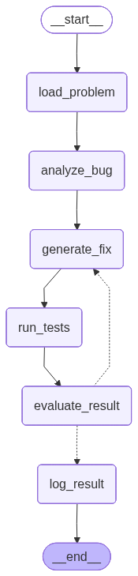

## Agent Logic Flow
This repository implements an LLM-based agent that fixes buggy Python code and evaluates its performance on the Python subset of the [HumanEvalFix dataset](https://huggingface.co/datasets/bigcode/humanevalpack). The goal is to test how our reAct agent can reason about, edit, and validate code through an automated process.

### Workflow
The agent follows a ReAct-style loop built with LangGraph:
1. Load Problem – Retrieve a task from the HumanEvalFix dataset.
2. Analyze Bug – Use reasoning to understand the failure.
3. Generate Fix – Produce a corrected version of the function.
4. Run Tests - Execute tests in a sandboxed environment.
5. Evaluate Result – Decide whether to retry or log the outcome.
6. Log Result – Store the final state and metrics.

If a test fails, the error details are passed back to the analysis step for another iteration until success or the retry limit is reached.

### Framework and Model
- Framework: LangGraph  
- Agent type: ReAct-style agent with a code interpreter tool  
- Model: gemma3:27b (local inference)

### Evaluation
- Benchmark: Python subset of HumanEvalFix   
- Metric: pass@1  

### Flow Diagram
The diagram below shows the logic of the agent pipeline:

  

### How to Run

1. Create environment and install dependencies
pip install -r requirements.txt

2. Run the main experiment
python -m organized_agent.main

### Data and Method

Each HumanEvalFix task includes:
- A **buggy implementation** of a Python function  
- A **docstring** describing the intended behavior  
- A short **instruction** clarifying the task  
- A **bug type** and **failure symptom** field describing the issue  
- A set of **unit tests** and the **canonical (expected) solution**

The agent uses:
- The **buggy code**,  
- The **docstring**,  
- The **instruction**, and  
- The **bug type** and **failure symptom** metadata  

The **unit tests were never shown** to the model during reasoning or generation to help reason about the problem and generate a corrected function.  
They were only used afterward for **independent evaluation**, ensuring a fair, test-blind setup.  
While access to the tests would likely improve performance, this approach better measures genuine reasoning and code understanding.

### Results

Using **Gemma 3 (27B)** under local inference, the agent achieved a **pass@1 accuracy of 51.22%%** on the HumanEvalFix Python subset. The model never accessed the test cases during generation, relying only on the buggy code, docstring, instruction, and bug metadata. Despite the test-blind setup, it successfully repaired over half of the benchmark tasks, demonstrating strong reasoning and debugging ability for a fully autonomous system.

### Error Analysis

Among the failed cases, most errors were **AssertionError (64)**, followed by **NameError (10)**, and **TypeError (6)**. This indicates that the majority of failures occurred when the generated fix produced incorrect output logic rather than syntax or type issues. In other words, the agent usually generated runnable code, but the logic sometimes failed to meet the expected behavior defined by the tests.

### Repository Structure

Please refer to **`structure.txt`** for a detailed overview of the repository layout and file organization.
